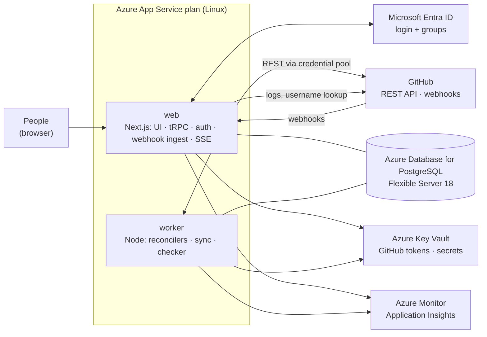
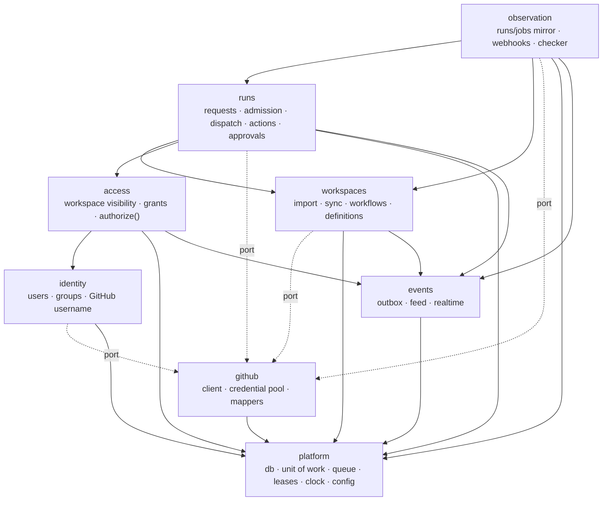

# 01 — System Architecture

**System:** Workflow Control Plane — a clean, governed way to run GitHub Actions workflows.
**Shape:** One Next.js codebase → two processes (`web` = Next.js server, `worker` = Node entry point in the same codebase) → one PostgreSQL database, on Azure.

---

## 1. What the system does

An **admin imports a GitHub repository** as a **workspace**. The system syncs its workflows. The admin decides which workflows are exposed, how they look, who may see or run them (or makes the workspace public), and whether runs need approval. **Users** sign in with Entra ID, see the workspaces they're allowed to see, run workflows through a clean form, and watch them live. GitHub does the execution; we own intent, access, history and the experience.

| In scope (core) | Out of scope (later, as listeners) |
|---|---|
| Workspaces (import, sync, visibility, grants) | Notifications, chat, ticketing |
| Catalog of exposed workflows with input forms | External automation API |
| Governed runs: validation, approvals, concurrency | Other CI providers |
| Reliable dispatch through a pool of GitHub credentials | |
| Live mirror of runs, jobs and steps | |
| Events for everything (feed the UI live; audit trail) | |

---

## 2. Principles (unchanged contract)

1. No external message is assumed to arrive exactly once.
2. No webhook is required for correctness (polling converges); no poll is required for latency (webhooks are fast).
3. No authoritative state in memory — everything that matters is in PostgreSQL.
4. Every reconcile step is safe to run twice.
5. Intent is durable before any side effect; every GitHub side effect carries a correlation tag.
6. Authorization happens before side effects and is re-checked right before dispatch.
7. A state change and its event commit together.
8. **New:** GitHub capacity is a pool; losing one credential never stops the system.
9. **New:** Access is decided by this app's admins; GitHub identity is only used for attribution.

The database enforces the state machine, forward-only GitHub status, frozen intent, self-approval ban, append-only events and per-process write permissions (`db/schema.sql`, proven by `db/schema-checks.sql`).

---

## 3. Context



---

## 4. Processes

| Process | Runs | Scales by |
|---|---|---|
| **web** (`next start` from standalone output) | Pages (React Server Components), tRPC API incl. SSE subscriptions, Better Auth routes, `POST /api/webhooks/github`, health | Users |
| **worker** (`node worker.mjs`) | Dispatch, verify, run actions, catalog sync, webhook processing, Checker, credential health, approval expiry, housekeeping, migrations on start (under an advisory lock) | GitHub activity |

Both import the same modules from `server/core`. Business logic lives once.

---

## 5. Core modules (inside `server/core`)



| Module | Owns (writes) |
|---|---|
| identity | `auth.*` (through Better Auth), `directory_groups`, `user_groups`, GitHub username fields |
| access | `workspace_grants`; visibility fields of `workspaces` |
| workspaces | `workspaces` (sync fields), `workflows`, `workflow_definitions`, `workspace_credentials` |
| runs | `run_requests`, `run_actions`, `approval_requests`, `approval_decisions` |
| observation | `workflow_runs`, `workflow_jobs`, `webhook_deliveries`, `inbox_seen` |
| events | `events`, `event_consumers` |
| github | `github_credentials` (health), `github_rate_buckets`, `github_http_cache` |
| platform | `work_queue`, `leases` |

---

## 6. Control loops (worker)

| Loop | Trigger | Does |
|---|---|---|
| **Workspace sync** | Import, push to `.github/workflows/**`, schedule (hourly), admin "Sync now" | Repo metadata, workflow list, dispatch inputs per ref → JSON Schema |
| **Dispatch** | `dispatch` queue | Re-authorize → slot → `dispatching` → pick credential → call GitHub → `dispatched` / `verifying` / `failed` |
| **Verify** | `dispatch` queue (delayed) | Find run by correlation tag (any credential); adopt or re-dispatch after the grace window |
| **Run actions** | `run-action` queue | Cancel / re-run via GitHub |
| **Webhook processor** | New `webhook_deliveries` rows | Route `workflow_run`, `workflow_job`, `push`, `repository` events |
| **Checker** | Every 15 s under a lease | Unfinished runs not confirmed for 60 s → fetch; polling-mode workspaces → list recent runs |
| **Credential health** | Every 10 min + on failures | Validate each credential, read expiry header, mark `expired`/`invalid`, refresh workspace coverage, alert at 14 days to expiry |
| **Approval expiry** | Every minute under a lease | Expire overdue approvals → reject their requests |
| **Slot release** | `run_request.completed` reactor | Wake the next queued deploy on that concurrency key |
| **Housekeeping** | Daily under a lease | Partitions ahead, prune inbox, drop expired partitions |

---

## 7. Key flows

### 7.1 Import a repository (admin)

```mermaid
sequenceDiagram
    autonumber
    actor A as Admin
    participant W as web (tRPC workspaces.import)
    participant DB as PostgreSQL
    participant K as worker (sync)
    participant G as GitHub (via pool)

    A->>W: import "acme/payments-service", credentials [bot-a, bot-b]
    W->>G: GET /repos/acme/payments-service (validate access with each credential)
    W->>DB: workspace (importing) + workspace_credentials + event + enqueue sync
    W-->>A: workspace created, syncing…
    K->>G: list workflows; read each file at default branch
    K->>DB: workflows + definitions (input JSON Schema, run-name tag check)
    K->>G: create repo webhook (if a credential may), else polling mode
    K->>DB: workspace active + events
    Note over A: Admin then exposes workflows, sets visibility / grants / approvals
```

### 7.2 Run a workflow

```mermaid
sequenceDiagram
    autonumber
    actor P as Priya
    participant W as web (tRPC runs.create)
    participant DB as PostgreSQL
    participant K as worker (dispatch)
    participant POOL as credential pool
    participant G as GitHub

    P->>W: run Deploy (staging, v1.9.4), idempotency key
    W->>W: authorize (grant/public role, environment) · validate inputs · approval? · concurrency
    W->>DB: run_request + events + enqueue dispatch (one transaction)
    W-->>P: request (phase pending) — UI subscribes to its events
    K->>DB: claim; re-authorize; phase dispatching (version-guarded); COMMIT
    K->>POOL: pick credential for workspace (dispatch-capable, most budget)
    K->>G: workflow_dispatch (return_run_details) with _cp_tag
    alt 200 + run id
        K->>DB: dispatched, github_run_id, dispatched_with
    else rate-limited / 401
        K->>POOL: mark bucket blocked / credential invalid
        K->>DB: stay dispatching → verify path (never blind retry)
    else timeout / 5xx
        K->>DB: verifying → search by tag before any retry
    end
```

### 7.3 Credential failover

A credential is skipped automatically when its account bucket is exhausted or blocked, when it has expired, or when GitHub rejects it (`401` → `invalid`). The next best credential serves the workspace. If **no** credential can serve a workspace, requests wait with a `NoGitHubCapacity` condition (visible in the UI and to admins) and resume on their own when a bucket resets or an admin adds a token. A dispatch that failed on one credential is **never** blindly resent on another: it goes through verify-by-tag first, because the first attempt may have succeeded.

---

## 8. Run-request state machine

Unchanged. Phases: `pending → (awaiting_approval) → (waiting_for_slot) → dispatching → (verifying) → dispatched → running → succeeded | failed | cancelled`, plus `cancelling`, `rejected`, `lost`. Legal transitions: `cp.phase_transition_allowed()` (enforced by trigger).

---

## 9. Consistency and failure handling

| Concern | Mechanism |
|---|---|
| Request + events + work item | One transaction |
| Concurrent writers | `resource_version` compare-and-set |
| Missed webhooks | Checker (≤ 60 s for unfinished runs); polling mode for workspaces without a webhook |
| Duplicate / reordered webhooks | Delivery GUID dedupe; forward-only status (DB trigger) |
| Unknown dispatch outcome | `verifying` → search by tag → adopt or retry |
| Token expired / revoked / exhausted | Pool picks another credential; condition + admin alert when none left |
| Two production deploys | Partial unique index on concurrency key |
| Access revoked before dispatch | Re-authorization in the dispatcher → `rejected` |
| Workflow file changed | Sync on push; admission validates against the definition at the ref |
| Web or worker crash | Leases/locks expire; another instance continues; nothing in memory matters |
| Database failover | Brief outage; everything resumes from durable state |

---

## 10. Non-functional targets

| Target | Value |
|---|---|
| Click → GitHub run id | p95 < 3 s |
| GitHub change → visible in UI (webhook mode) | p95 < 5 s |
| Missed webhook → corrected | < 75 s for unfinished runs |
| UI navigation (cached) | < 100 ms perceived |
| Availability (internal tool) | 99.5 % (single region, HA database) |
