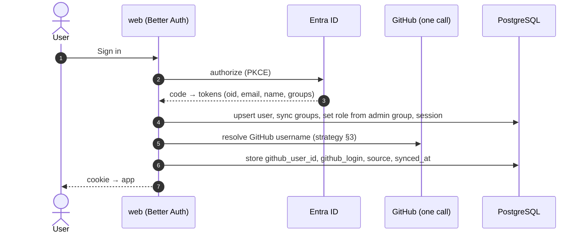

# 02 — Identity and Access

Simple by design: **admins import and govern workspaces; users see what they're granted (or what is public) and run what their role allows.** GitHub identity is stored for attribution and never grants anything.

---

## 1. Sign-in: Microsoft Entra ID through Better Auth

| Aspect | Design |
|---|---|
| Provider | Better Auth's Microsoft provider, restricted to **our tenant** (single-tenant app registration) |
| Flow | Authorization code + PKCE; Better Auth creates a database session and an `HttpOnly`, `Secure`, `SameSite=Lax` cookie |
| Stored | `auth.users` (name, email, Entra object id), `auth.sessions`, `auth.accounts` (provider link). We don't need Entra tokens after login — configure Better Auth not to keep them, or encrypt them |
| Groups | The ID token's `groups` claim (group object ids) is synced into `cp.user_groups` at every login. Configure the app registration to emit **only groups assigned to the application**, to stay under Entra's token group limit; on overage, read membership from Microsoft Graph once at login |
| App admin | Members of the Entra group `CP_ADMIN_GROUP_ID` get `role = 'admin'` at login; removing them from the group removes admin at next login (sessions are short: 8 h, sliding) |
| Deactivation | A user missing from the tenant can't log in; admins can also set `is_active = false`, which revokes all sessions |

The GitHub lookup is best-effort and never blocks login: if it fails, the user logs in and the lookup retries later.

---

## 2. Roles and access model

### 2.1 Two app roles

| Role | Can |
|---|---|
| **admin** | Everything: import/sync/archive workspaces, manage the credential pool, expose and configure workflows, set visibility, grant access, approve anything, see everything |
| **user** | Whatever workspace visibility and grants allow |

### 2.2 Workspace visibility

| Visibility | Who sees it | Default role for everyone |
|---|---|---|
| **private** | Admins + users/groups with a grant | — |
| **public** | Every signed-in user | `public_role`: `viewer` or `operator` (admin chooses) |

Grants still apply on public workspaces to give **more** than the public role (for example, operator or approver for a release group).

### 2.3 Grants

A grant gives a **user** or an **Entra group** one role on one workspace:

| Field | Meaning |
|---|---|
| `role` | `viewer` (see workflows, runs, logs) or `operator` (viewer + run, cancel, re-run) |
| `can_approve` | May approve gated runs in this workspace (never their own) |
| `environments` | Optional: operator only for these environments (e.g. `{dev, staging}`) |
| `expires_at` | Optional temporary access |

### 2.4 How a decision is made — `authorize(user, action, workspace, workflow?, environment?)`

1. Inactive user → deny.
2. Admin → allow.
3. Collect the user's **effective role** on the workspace: highest of (`public_role` if public) and every non-expired grant to the user or any of their groups.
4. Non-exposed workflows are visible to admins only.
5. Check the action against the role (matrix below). For `run`, if a matching grant limits environments, the requested environment must be in the list (the public role is never environment-limited, so admins should use `viewer` as public role for sensitive repos).
6. For `approve`: needs `can_approve` from any grant (or admin), and the user must not be the requester.
7. Workflow rules apply after authorization: allowed ref patterns, approval required, concurrency.

### 2.5 Permission matrix

| Action | admin | operator | viewer | approver (`can_approve`) |
|---|---|---|---|---|
| See workspace, exposed workflows, runs, logs | ✓ | ✓ | ✓ | ✓ |
| Run a workflow (subject to env limits and rules) | ✓ | ✓ | | (only if also operator) |
| Cancel / re-run | ✓ | ✓ | | (only if also operator) |
| Approve / deny gated runs (not own) | ✓ | | | ✓ |
| See non-exposed workflows | ✓ | | | |
| Import / sync / archive workspace | ✓ | | | |
| Visibility, grants, workflow settings | ✓ | | | |
| Credential pool | ✓ | | | |

### 2.6 Where it is enforced

| Layer | Enforcement |
|---|---|
| tRPC middleware | `authed` (valid session), `admin` (role), `workspace(min role)` — fast rejection |
| Core services | Every command and query calls `access.authorize(...)` — the real gate; reused by the worker |
| Worker | Re-authorizes the requester immediately before dispatch |
| Database | Per-process write permissions (`cp_web`, `cp_worker`); self-approval trigger |
| UI | Hides what the server would refuse (`me.capabilities`), never the only check |

---

## 3. GitHub username — attribution only

**Purpose:** show "Priya (@priya-gh)" everywhere, include the requester's GitHub login in dispatch inputs if a workflow wants it (`_cp_requested_by`), and match runs started directly on GitHub to our users ("My runs"). Runs we dispatch appear in GitHub under the **credential's** account; our events are the record of who really asked.

**Key:** we store GitHub's numeric `github_user_id` (never changes) plus `github_login` (refreshed, can change on rename).

### Resolution strategies (tried in order at login, one API call each)

| # | Strategy | Works when | Trust |
|---|---|---|---|
| 1 | **Already known** → refresh by id (`GET /user/{id}`) | Any user resolved before | High; catches renames |
| 2 | **SAML identity lookup** — the GitHub org's SAML identities map the Entra identity (UPN/email) to a GitHub login | Org uses GitHub Enterprise Cloud with SAML SSO through Entra; needs a pool credential with org-owner read access to identities | High (`source = saml`) |
| 3 | **Self-declared** — the user types their username once in Profile; validated with `GET /users/{username}` and stored | Always | Low (`source = self_declared`); admins can correct (`source = admin`) |

Rules:

- A username **never** grants access, so a wrong self-declared value can only mislabel attribution — admins see the source and can fix it.
- Two users can't claim the same GitHub account (`github_user_id` is unique).
- Lookups use the credential pool's **read** budget at low priority; failures don't block login.

---

## 4. Approvals

Configured per workflow by an admin: `approval_required`, optional `approval_environments`, `approval_min` (1–5), `approval_ttl`.

- Request needs approval → phase `awaiting_approval`, approval record created.
- Approvers: users with `can_approve` on the workspace, or admins; never the requester (also enforced by the database).
- Any deny → `rejected`. Enough approvals → dispatch. TTL passes → `rejected` (`approval_expired`).
- The dispatcher re-checks the requester's access right before sending.

---

## 5. Audit

Every access-relevant change emits an event: `cp.workspace.visibility_changed`, `cp.workspace.grant_added/removed`, `cp.identity.github_linked`, `cp.credential.*`, plus all run and approval events. The `events` table is the audit trail (13-month retention by default).
