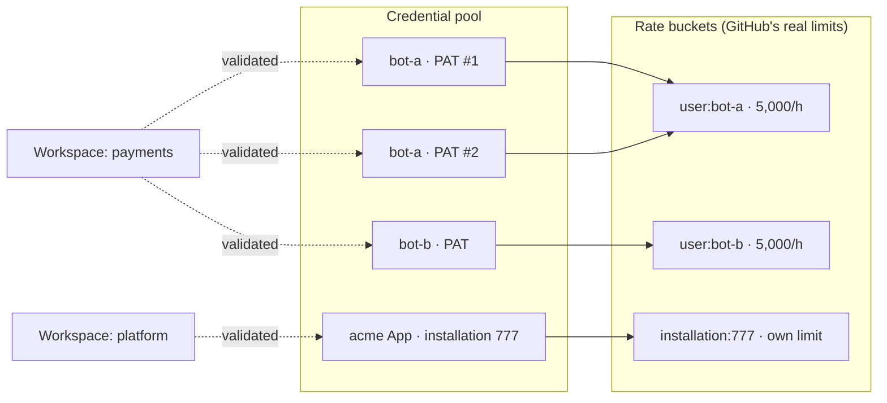
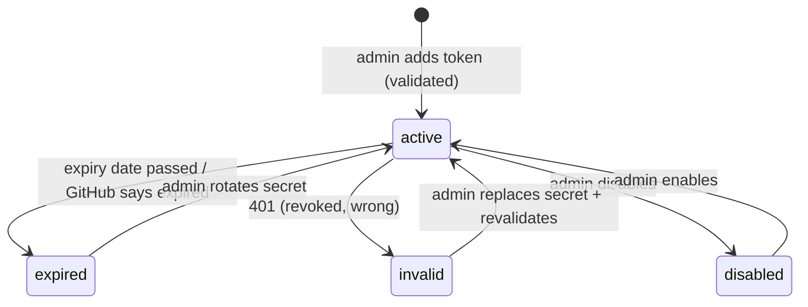

# 03 — GitHub Integration and the Credential Pool

All GitHub traffic goes through `server/github`: one client, one credential pool, one place that understands rate limits and GitHub's payloads. No other folder calls GitHub (enforced by an ESLint import zone).

---

## 1. What we call

| Purpose | Endpoint (REST) | Permission needed (fine-grained PAT / GitHub App) |
|---|---|---|
| Validate repo, metadata | `GET /repos/{owner}/{repo}` | Metadata: read |
| List workflows | `GET /repos/{owner}/{repo}/actions/workflows` | Actions: read |
| Read workflow file at a ref | `GET /repos/{owner}/{repo}/contents/{path}?ref=` | Contents: read |
| Branches / tags for the ref picker | `GET …/branches`, `GET …/tags` | Contents: read |
| Environments for the form | `GET …/environments` | Repository environments: read |
| **Dispatch** | `POST …/actions/workflows/{id}/dispatches` with `return_run_details: true` | **Actions: write** |
| Runs, jobs, logs | `GET …/actions/runs/{id}`, `…/attempts/{n}/jobs`, `…/jobs/{id}/logs` | Actions: read |
| Cancel / re-run | `POST …/runs/{id}/cancel`, `/rerun`, `/rerun-failed-jobs`, `…/jobs/{id}/rerun` | **Actions: write** |
| Repo webhook (optional) | `POST/DELETE …/hooks` | Webhooks: write |
| Username lookup | `GET /users/{username}`, `GET /user/{id}` | none (public) |

Every request pins the REST API version header (`X-GitHub-Api-Version`, currently `2026-03-10`). Version bumps are deliberate, tested changes.

**Recommended credential shape:** fine-grained PATs owned by **dedicated service accounts**, limited to the repositories we import, with *Actions: read & write, Contents: read, Metadata: read*, and *Webhooks: read & write* only if you want automatic webhook setup. A GitHub App installation is supported as a pool member too (own rate limit, auto-rotating tokens).

---

## 2. The pool

### 2.1 Model

| Concept | Meaning |
|---|---|
| **Credential** | One secret (stored in **Key Vault**; the DB holds only its name) + metadata: kind, owner account, status, priority, expiry |
| **Rate bucket** | The budget GitHub actually enforces: per **account** for PATs (`user:<id>`), per **installation** for Apps (`installation:<id>`). All of an account's tokens share one budget |
| **Coverage** | Which credentials are validated for which workspace (`workspace_credentials`), and whether each may dispatch |

**Why buckets matter:** GitHub counts every PAT of a user against that user's single 5,000 requests/hour budget. Two tokens from one account give **failover** (one expires, the other works) but **not** more capacity. More capacity means tokens from **different accounts** or App installations. The schema enforces that a credential's bucket is its owner's, so the picker can't be fooled.

### 2.2 Credential lifecycle

Health job (every 10 min and after failures): call `GET /rate_limit` per bucket (doesn't consume primary budget), read the token-expiration response header for PATs, re-validate coverage for workspaces that reported a `404`/`403`. **Alerts:** expiry in < 14 days; a workspace with only one dispatch-capable credential; a workspace with none.

### 2.3 Picking a credential

`cp.pick_credential(workspace, needDispatch, resource)` returns the best candidate:

1. Active, not expired, validated for this workspace, dispatch-capable if needed.
2. Its bucket isn't open-circuited, isn't blocked (`Retry-After`), and has budget left (or its reset time has passed).
3. Order: most remaining budget → admin priority → least recently used.

On top of that, the client applies **priority classes** so background work can't starve users:

| Class | Work | May use a bucket when remaining ≥ |
|---|---|---|
| P0 | Dispatch, cancel, re-run (user actions) | 1 |
| P1 | Status checks of unfinished runs, verify-by-tag | 200 |
| P2 | Workspace sync, definitions | 1,000 |
| P3 | Username lookups, nightly sweeps | 2,000 |

**Stickiness:** for reads, prefer the credential last used for that workspace while it's healthy, so conditional requests (`If-None-Match`) keep hitting the same cache entries.

### 2.4 Reading GitHub's answers

| Response | Action |
|---|---|
| Any response | Update the bucket from `x-ratelimit-remaining / -reset / -resource`; record `last_used_at` |
| `403`/`429` with remaining `0` | Bucket `remaining = 0` until reset → next call picks another bucket |
| `403`/`429` secondary limit | Bucket `blocked_until` = `Retry-After` (or ≥ 60 s, growing exponentially) |
| `401` | Credential `invalid` + admin alert |
| `404`/`403` on a repo that worked before | Coverage for that credential + workspace removed; health job re-validates |
| `5xx` / timeouts | Breaker per bucket opens after repeated failures; half-opens after a cool-down |
| PAT expiration header | Store `expires_at` |

**Pacing:** respect GitHub's secondary limits — at most 100 concurrent requests, and content-creating calls (dispatch, re-run) paced per bucket. The worker keeps a small per-bucket concurrency limit (default 10).

### 2.5 Failover never duplicates a dispatch

A dispatch that fails **ambiguously** on one credential (timeout, 5xx) is **not** resent with another credential. The request goes to `verifying`; the verifier searches recent `workflow_dispatch` runs for the correlation tag (with any healthy credential). Only when the run provably doesn't exist after the grace window is it dispatched again — with whichever credential is best at that moment. A **definite** refusal caused by the credential itself (`401`, rate-limited before acceptance) is safe to retry immediately with the next credential, because GitHub did not accept it.

---

## 3. Getting updates from GitHub

| Mode | When | How |
|---|---|---|
| **Webhook** | A pool credential for the workspace has *Webhooks: write* | At import the worker creates a repo webhook (`workflow_run`, `workflow_job`, `push`, `repository`) to `https://<app>/api/webhooks/github` with a per-deployment secret; deliveries verified by HMAC SHA-256, deduped by delivery GUID, stored, processed by the worker |
| **Polling** | No webhook permission, or the admin prefers it | Checker lists recent runs for the workspace every 30 s while anything is active (60 s idle), with conditional requests; unfinished runs fetched every 15–60 s |

Both modes use the **same** observation path: one forward-only rule for applying facts. Webhook mode still runs the Checker as a safety net.

---

## 4. Dispatch details

- Inputs sent = user's validated inputs + reserved `_cp_tag` (correlation) + optional `_cp_requested_by` (GitHub login or email) — reserved names count toward GitHub's 25-input limit.
- Workflows should include the tag in `run-name` (for example `run-name: Deploy ${{ inputs.environment }} · ${{ inputs._cp_tag }}`). The catalog marks workflows without it as **weaker duplicate protection** and shows admins how to fix it.
- `return_run_details: true` gives the run id in the normal case; verify-by-tag covers timeouts.
- `dispatched_with` records which credential sent each run (support and audit).

---

## 5. Logs

Job logs are fetched by the **web** process with a pool credential and streamed to the browser (never exposing the token or GitHub's signed URL). Finished job logs are cached briefly in memory per instance; nothing is stored in the database.

---

## 6. Admin experience for the pool

| Screen element | Behaviour |
|---|---|
| **Add credential** | Paste token (sent once over TLS, written to Key Vault, never shown again) → validated: owner account, expiry, limit; choose priority |
| Coverage matrix | Workspaces × credentials: ✓ dispatch · ◐ read-only · ✗ no access; "Re-validate" |
| Budgets | Per bucket: remaining / limit, reset time, blocked/breaker state |
| Warnings | "bot-a expires in 9 days", "Payments has a single dispatch-capable account" |
| Rotate | Replace secret for an existing credential; history kept in events |
