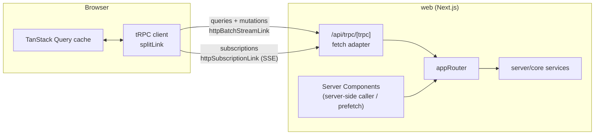

# 04 — API (tRPC)

All communication between the UI and the server is a typed tRPC API. Route handlers exist only where plain HTTP is required (auth callbacks, GitHub webhooks, raw log streaming, health).

---

## 1. Rules

| Topic | Rule |
|---|---|
| One gate | Procedures are thin: validate input → call a `server/core` service → map the result. Authorization lives in core services, not only in middleware |
| Input | Zod 4 schemas from `shared/`; same schemas render forms in the UI |
| Output | Explicit DTOs (never raw rows); dates serialized via a transformer (superjson) |
| Naming | `router.verbNoun` — `runs.create`, `workflows.definition`, `approvals.decide` |
| Idempotency | Creating procedures take an `idempotencyKey` (generated when a form opens) |
| Concurrency | Admin updates take `expectedVersion`; mismatch → `CONFLICT` with the current version |
| Pagination | Cursor-based: `{ cursor?, limit }` → `{ items, nextCursor }` (works with infinite queries) |
| Long work | Never wait on GitHub inside a procedure (except validated reads like refs/environments with short timeouts). Commands return the intent; progress arrives through the live stream |

---

## 2. Transport

- **Queries/mutations:** `httpBatchStreamLink` (batched, streamed responses).
- **Subscriptions:** `httpSubscriptionLink` over **Server-Sent Events**, with `tracked(id)` so the client resumes from the last event after a reconnect. SSE ping every 15 s keeps Azure's idle timeout away.
- **Server Components:** pages prefetch data on the server through the router (same auth, same services) and hydrate the client cache — first paint has data, no loading spinners for primary content.
- Enable HTTP/2 on App Service; the app still opens only **one** subscription per tab (§5), so browser connection limits are never an issue.

---

## 3. Context and middleware

**Context** (per request): Better Auth session (from request headers) → `user` (id, role, active, GitHub login), `groupIds`, `requestId` (also stored on every event the request causes), and the core service container.

| Builder | Adds |
|---|---|
| `publicProcedure` | Request id, tracing span |
| `authedProcedure` | Requires an active session; per-user rate limit (default 300 calls/min) |
| `adminProcedure` | Requires `role = admin` |
| `workspaceProcedure(minRole)` | Resolves the workspace from input, computes the user's effective role, rejects with `NOT_FOUND` if invisible (doesn't leak existence) or `FORBIDDEN` if visible but insufficient |

---

## 4. Routers

### `me`
| Procedure | Type | Purpose |
|---|---|---|
| `me.get` | query | Profile, role, GitHub identity (+ source), capability summary per visible workspace |
| `me.setGithubUsername` | mutation | Self-declare username → validated with one GitHub call |
| `me.preferences` / `me.updatePreferences` | query / mutation | Favourites, pinned workspaces, density, theme |

### `workspaces`
| Procedure | Type | Access |
|---|---|---|
| `workspaces.list` | query | Visible to the user (filters: favourites, search) |
| `workspaces.get` | query | `viewer+` |
| `workspaces.searchGithub` | query | admin — repos reachable by any pool credential, for the import dialog |
| `workspaces.import` | mutation | admin — repo + credentials to use; returns workspace (`importing`) |
| `workspaces.sync` | mutation | admin — enqueue sync now |
| `workspaces.update` | mutation | admin — display name, description, **visibility**, `public_role` (`expectedVersion`) |
| `workspaces.archive` | mutation | admin |
| `workspaces.grants.list / add / update / remove` | query / mutations | admin — user or Entra group, role, `can_approve`, environments, expiry |
| `workspaces.credentials.list / attach / detach / revalidate` | query / mutations | admin |

### `workflows`
| Procedure | Type | Access |
|---|---|---|
| `workflows.list` | query | `viewer+` (non-exposed only for admins) |
| `workflows.get` | query | `viewer+` — includes the caller's capabilities (can run? which environments? approval needed?) |
| `workflows.definition` | query | `viewer+` — input JSON Schema + UI schema for a ref, allowed refs, approval preview |
| `workflows.refs` | query | `viewer+` — branch/tag search for the ref picker (filtered by allowed patterns) |
| `workflows.update` | mutation | admin — exposure, display, UI hints, allowed refs, approval rules, concurrency |

### `runs`
| Procedure | Type | Access |
|---|---|---|
| `runs.validate` | query | `operator` — dry-run admission: field problems, approval needed, slot busy |
| `runs.create` | mutation | `operator` (+ environment limits) — `idempotencyKey` required |
| `runs.list` | infinite query | `viewer+` — filters: mine, workspace, workflow, phase, time |
| `runs.get` | query | `viewer+` — spec/status, conditions, linked GitHub run |
| `runs.timeline` | query | `viewer+` — the request's events |
| `runs.cancel` | mutation | `operator` |
| `runs.action` | mutation | `operator` — `rerun_all` / `rerun_failed` / `rerun_job` / `cancel` on a GitHub run attempt; `idempotencyKey` |

### `githubRuns`
| Procedure | Type | Access |
|---|---|---|
| `githubRuns.list` | infinite query | `viewer+` — every run of the workspace, including ones started on GitHub |
| `githubRuns.get` | query | `viewer+` — attempt with freshness (`lastSeenAt`, `via`) |
| `githubRuns.jobs` | query | `viewer+` — jobs with steps |

### `approvals`
| Procedure | Type | Access |
|---|---|---|
| `approvals.inbox` | infinite query | approvers — waiting for me / all / decided |
| `approvals.decide` | mutation | `can_approve` or admin; never own request |

### `credentials` (admin)
`list`, `add` (secret written to Key Vault), `rotate`, `setStatus`, `setPriority`, `revalidate`, `budgets`.

### `system` (admin)
`system.status` — queue depths and oldest item age, event-feed lag, drift corrections/hour, buckets, webhook health per workspace, last sync per workspace.

### `live` (subscriptions)
| Procedure | Purpose |
|---|---|
| `live.stream({ lastEventId?, workspaceIds? })` | **One** SSE stream per tab: every event the user may see (optionally narrowed to some workspaces). Each message is `tracked(cursor, event)` |

---

## 5. Real-time contract

1. The client opens `live.stream` once (app shell) with the last cursor it has (from `sessionStorage`).
2. The server checks the session, computes the user's visible workspace ids, and **replays** events after the cursor from `cp.read_events` (commit-safe). If the cursor is older than retention, it sends a `resync` message → the client invalidates queries.
3. Then it waits on the process's in-memory fan-out (fed by Postgres `LISTEN cp_events`), reads new rows, filters by visibility, and yields them.
4. Every message carries `aggregateVersion`; the client applies an event to the cache only if it's newer than what it has.
5. Visibility changes (grant removed) are themselves events: the stream re-computes the user's workspace set and stops sending for revoked ones.

Details of the server side: `05-events-and-realtime.md`.

---

## 6. Route handlers (not tRPC)

| Route | Purpose | Auth |
|---|---|---|
| `/api/auth/[...all]` | Better Auth (Entra sign-in, callback, sign-out, session) | — |
| `/api/trpc/[trpc]` | tRPC | session |
| `/api/webhooks/github` | GitHub deliveries → `cp.ingest_webhook` → `202` | HMAC signature |
| `/api/logs/[jobId]` | Streams a job log (plain text, chunked) | session + `viewer+` on the workspace |
| `/api/health`, `/api/ready` | Liveness, readiness (DB reachable, migrations at expected version) | none (restricted by App Service access rules) |

---

## 7. Errors

Core errors map to tRPC codes; the error formatter adds structured detail the UI can render:

| Core error | tRPC code | Extra data |
|---|---|---|
| Input invalid | `BAD_REQUEST` | `problems: [{ field, code, message }]` |
| Admission rejected (ref not allowed, workflow hidden…) | `UNPROCESSABLE_CONTENT` | `problems[]` |
| Not signed in | `UNAUTHORIZED` | — |
| Not allowed (visible resource) | `FORBIDDEN` | `required` (e.g. `operator`) |
| Not visible / missing | `NOT_FOUND` | — |
| Version mismatch, invalid state, idempotency reuse with different input | `CONFLICT` | `reason`, `currentVersion?` |
| Too many calls | `TOO_MANY_REQUESTS` | `retryAfter` |
| Unexpected | `INTERNAL_SERVER_ERROR` | `requestId` only |

Every error response includes `requestId`, which links to logs, traces and events.

---

## 8. Later: an external API

If automation clients appear: issue API keys (Better Auth API-key plugin), and expose a small REST surface (route handlers or an OpenAPI-capable adapter) over the **same core services** — `POST /v1/runs`, `GET /v1/runs/{id}`, and an event feed. Nothing in the core changes.
