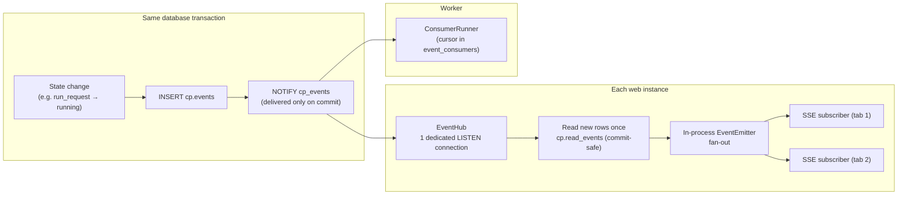

# 05 — Events and Real-Time

The core does its job and **tells**. Today the main listener is the UI (live updates) and the audit trail; tomorrow, any integration. This document also answers: **do Node.js events work at this level?** — only as the last, in-process step.

---

## 1. Three layers



| Layer | Technology | Role | Survives restart? |
|---|---|---|---|
| **Truth** | `cp.events` table | Durable, ordered, replayable, append-only; also the audit trail | Yes |
| **Doorbell** | Postgres `LISTEN/NOTIFY` | Tells every process "new events committed" | No — and doesn't need to: readers catch up from the table |
| **Fan-out** | Node `EventEmitter` (inside one process) | Hands the new rows to that process's open SSE subscriptions | No — and doesn't need to |

**Why not Node events alone:** an `EventEmitter` lives in one process's memory. Events emitted in the worker never reach the web process; a second web instance never sees the first one's events; a restart loses everything in flight; there's no replay for a reconnecting browser. Used **only** as the in-process fan-out, after the durable layers, it's exactly right.

**Why not Redis / Service Bus:** the database already guarantees "change and event commit together"; a broker would add a second system that can disagree with it. A broker relay can be added later as just another consumer.

---

## 2. Writing events

- Core services record domain events on aggregates; the **Unit of Work** inserts them into `cp.events` in the same transaction as the state change, then executes `NOTIFY cp_events` (Postgres delivers notifications only when the transaction commits — a rolled-back change never rings the bell).
- Each event carries: `type`, `version`, `subject`, `aggregateType/Id/Version`, `actor` (user / system / github), `workspaceId`, `workflowId`, `correlationId` (the tRPC request id), `causationId`, `data`.
- `id` is a UUIDv7; the feed cursor is `(txid, seq)`, encoded opaquely.

---

## 3. Reading events in the web process

**EventHub** (one per process, stored on `globalThis` so dev hot-reload doesn't create duplicates):

1. Holds **one dedicated connection** that `LISTEN`s on `cp_events`. It must be a **direct** connection (port 5432), not through the Flexible Server's built-in PgBouncer in transaction mode, which doesn't support `LISTEN`.
2. On a notification (coalesced over ~25 ms), reads new rows **once** for the whole process from a shared in-memory cursor using `cp.read_events`.
3. Emits them on the in-process emitter. Each subscriber filters by its user's visible workspaces and pushes matching events into its SSE stream.
4. If the LISTEN connection drops: reconnect with backoff and **poll every 2 s** meanwhile — no events are lost because reading is cursor-based.

**Subscriber lifecycle** (`live.stream`, see `04-api-trpc.md` §5): authenticate → replay from the client's cursor straight from the table → attach to the emitter → yield `tracked(cursor, event)` → detach on disconnect. Heartbeat (ping) every 15 s.

Scaling: every web instance runs its own EventHub. N instances = N LISTEN connections + N cheap reads per batch — fine for this system's volume.

## 4. Reacting to events in the worker

`ConsumerRunner` gives each internal reactor a name, a cursor row in `cp.event_consumers`, and a lease (one active runner per reactor). A reactor's database effects and its cursor advance commit together — effectively exactly-once for database work.

| Reactor | On | Does |
|---|---|---|
| `slot-release` | `cp.run_request.completed` | Enqueue the next `waiting_for_slot` request on the same concurrency key |
| `approval-dispatch` | `cp.approval.approved` | Enqueue `dispatch:<request>` |
| `workflow-resync` | `cp.workspace.push_to_workflows` | Enqueue definition sync for that ref |
| `access-cache` | `cp.workspace.grant_*`, `cp.identity.role_changed` | Invalidate per-user access caches (web listens too) |

---

## 5. Event catalog

| Domain | Types | Visible to |
|---|---|---|
| Runs | `cp.run_request.created`, `.phase_changed`, `.cancel_requested`, `.completed`; `cp.run_action.created`, `.completed`, `.failed` | Workspace viewers |
| GitHub mirror | `cp.github_run.observed`, `.status_changed`, `.completed`; `cp.github_job.status_changed`, `.completed` | Workspace viewers |
| Approvals | `cp.approval.requested`, `.decision_recorded`, `.approved`, `.denied`, `.expired` | Workspace viewers |
| Workspaces | `cp.workspace.imported`, `.synced`, `.sync_failed`, `.updated`, `.archived`, `.grant_added`, `.grant_removed`, `.push_to_workflows` | Viewers (grants: admins) |
| Workflows | `cp.workflow.discovered`, `.definition_changed`, `.removed`, `.updated` | Viewers (non-exposed: admins) |
| Credentials | `cp.credential.added`, `.rotated`, `.status_changed`, `.expiring_soon`, `.bucket_exhausted` | Admins |
| Identity | `cp.identity.github_linked`, `.role_changed` | The user + admins |
| System | `cp.system.drift_corrected`, `.no_capacity` | Admins |

Payload rule: enough to update the UI without a refetch for the common case (e.g. `phase_changed` carries `from`, `to`, `reason`, `githubRunId`), never secrets, never inputs marked sensitive.

### Example

```json
{
  "id": "0192f3a0-7c41-7b2e-9d5a-3f1b8c2e4a10",
  "type": "cp.run_request.phase_changed",
  "version": 1,
  "time": "2026-10-07T10:00:20.412Z",
  "subject": "run-requests/0192f39e-1b2c-7d3e-8f4a-5b6c7d8e9f00",
  "aggregateVersion": 5,
  "actor": { "kind": "github" },
  "workspaceId": "0192e001-…",
  "workflowId": 8801,
  "correlationId": "req-7f3a2c",
  "data": { "from": "dispatched", "to": "running", "githubRunId": 9001, "attempt": 1 }
}
```

---

## 6. Guarantees

| Guarantee | Mechanism |
|---|---|
| No change without its event | Same transaction |
| No skipped events for any reader | Commit-safe cursor |
| Resume after disconnect | SSE `tracked` ids + replay from table |
| Duplicates harmless | Client applies only newer `aggregateVersion`; reactors de-duplicate by cursor |
| Ordered per resource | `aggregateVersion` |
| Authorized | Per-user workspace filter on every event, recomputed on access events |

## 7. Versioning and retention

- Additive changes keep the version; breaking changes bump `version` and both versions are emitted during a transition.
- Retention 13 months (monthly partitions, dropped by housekeeping). The run timeline in the UI reads from here.

## 8. Later: external listeners

Add a relay consumer (worker) that publishes events to Azure Service Bus or Event Grid, or expose a pull feed endpoint. The core doesn't change.
