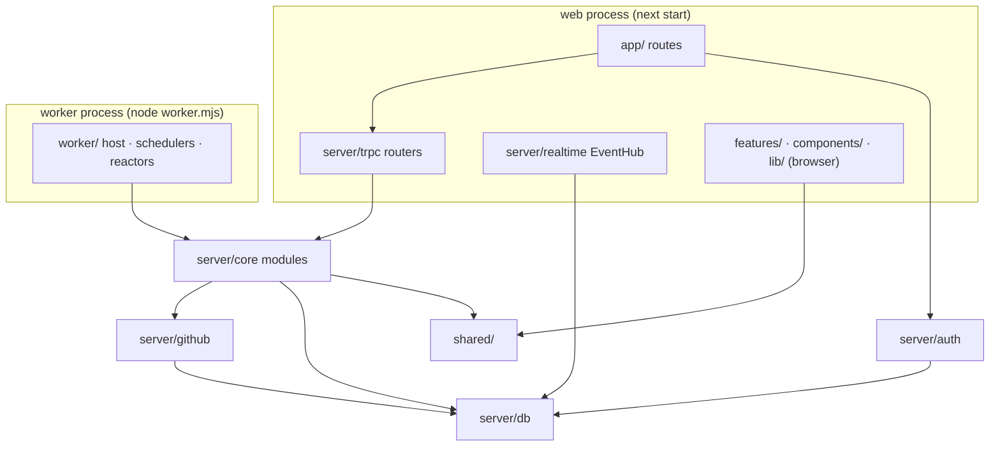

# 07 — Code Design (single Next.js codebase)

One `package.json`, one `tsconfig.json`, no monorepo tools, no `src/` folder. The web server and the worker are two **entry points** of the same codebase. Business logic lives in a framework-free folder (`server/core`) that both import. No code here — names, responsibilities and rules.

---

## 1. Folder layout (repository root)

```
control-plane/
├── app/                        Next.js App Router — routes only, kept thin
│   ├── (app)/                  signed-in area (shell + live stream)
│   ├── (admin)/admin/          admin area (role checked in layout)
│   └── api/
│       ├── trpc/[trpc]/route.ts
│       ├── auth/[...all]/route.ts
│       ├── webhooks/github/route.ts
│       ├── logs/[jobId]/route.ts
│       └── health/route.ts
├── features/                   UI per feature (components, hooks, query keys)
├── components/                 shared UI; components/ui = shadcn (Base UI)
├── lib/                        browser-side helpers: trpc client, query client, live stream manager, Zustand stores
├── shared/                     Zod schemas, DTOs, phase vocabulary, event types — safe for client and server
├── server/                     server-only code (every module starts with `import 'server-only'`)
│   ├── core/                   business modules: identity · access · workspaces · runs · observation · events · platform
│   ├── github/                 GitHub client, credential pool, adapters, mappers
│   ├── db/                     Drizzle schema, client, unit of work, migrator
│   ├── auth/                   Better Auth configuration + hooks
│   ├── trpc/                   init, context, procedure builders, routers
│   ├── realtime/               EventHub (LISTEN + in-process fan-out for SSE)
│   └── container.ts            createCore(deps) — builds services for a process
├── worker/                     worker entry point and runtime (imports server/*, never app/ or components/)
│   ├── main.ts                 config → migrate → createCore → WorkerHost → schedulers → reactors → health server
│   ├── host/                   WorkerHost, QueueConsumer, LeasedScheduler, ConsumerRunner
│   └── health.ts               tiny HTTP server for App Service health checks
├── drizzle/                    SQL migrations (generated + hand-written triggers/functions), reference schema, schema-checks.sql
├── e2e/                        Playwright journeys + fake GitHub server
├── scripts/                    build-worker (esbuild), seed, dev helpers
├── infra/                      Bicep for Azure
├── public/
├── docs/
├── instrumentation.ts          OpenTelemetry → Azure Monitor; starts the EventHub (web only)
├── next.config.ts · drizzle.config.ts · tsconfig.json · eslint.config.mjs · vitest.config.ts · playwright.config.ts
├── docker-compose.yml          local PostgreSQL 18
└── package.json · pnpm-lock.yaml · .env.example
```

Path alias: `@/*` → repository root (`@/server/core/runs`, `@/shared/phases`, `@/components/ui/button`).

---

## 2. Boundaries without packages

Folders replace packages; two stable mechanisms keep them honest.

| Rule | Enforced by |
|---|---|
| Server code never reaches the browser bundle | `import 'server-only'` at the top of every `server/**` module (Next.js fails the build otherwise) |
| `server/core` imports no Next.js, React, tRPC, `app/`, `features/`, `components/`, `lib/` | ESLint `no-restricted-imports` zones |
| Only `server/github` imports the GitHub client; only `server/db` creates database connections | ESLint zones |
| `shared/` imports only Zod | ESLint zone |
| `worker/` imports `server/*` and `shared/` only | ESLint zone |
| `app/` route files contain no business logic (call routers / core only) | Review rule + small size |
| A core module is used only through its `index.ts` | ESLint: no deep imports into `server/core/<module>/*` from outside the module |

Note on `server-only`: the package resolves to an empty module under the `react-server` export condition and throws otherwise. The worker therefore runs with that condition: esbuild builds it with `conditions: ['react-server']`, and in development it starts with `NODE_OPTIONS=--conditions=react-server tsx watch worker/main.ts`. The worker imports no React, so the condition changes nothing else. Same code in both processes.

---

## 3. Shape and dependencies



---

## 4. Inside a core module

```
server/core/runs/
  domain/          RunRequest, RunAction, ApprovalRequest, phases, CorrelationTag, ConcurrencyKey, errors, events
  application/     createRun, cancelRun, createRunAction, decideApproval, validateRun (dry-run)
    admission/     pipeline + rules
    reconcilers/   dispatch, runAction, approvalExpiry, slotRelease
    ports.ts       WorkflowDispatcher, RunFinder, RunCanceller, RunReRunner, repositories
  infrastructure/  Drizzle repositories, row ↔ domain mappers
  index.ts         public surface (services + types only)
```

- **domain** is pure TypeScript: rules, transitions, domain events recorded on aggregates.
- **application** holds use cases: `(actor, input)` → authorize via `access` → load → change → save through the unit of work.
- **ports** are interfaces the module needs; implemented in `infrastructure` or by `server/github`.

---

## 5. Composition — `server/container.ts`

`createCore(deps)` builds every service once per process from explicit dependencies; no DI framework, no decorators.

| Dependency | Web | Worker | Tests |
|---|---|---|---|
| `db` | role `cp_web` | role `cp_worker` | Testcontainers PostgreSQL 18 |
| `github` (client + pool) | yes | yes | fake GitHub |
| `secrets` (Key Vault) | yes | yes | in-memory |
| `clock`, `ids`, `logger`, `tracer` | real | real | controllable |

The web process creates the container once (module singleton stored on `globalThis`, so dev hot-reload doesn't duplicate pools) and puts it in the tRPC context. The worker creates it in `worker/main.ts`.

---

## 6. Platform building blocks (`server/db`, `server/core/platform`)

| Building block | Responsibility |
|---|---|
| `Database` | Drizzle over `node-postgres`; separate connection for `LISTEN`; passwordless Entra auth with the managed identity (token per new connection) |
| `UnitOfWork.run(fn)` | Transaction via `db.transaction`, exposed through `AsyncLocalStorage`; collects domain events → inserts into `cp.events`; `NOTIFY cp_events`; inserts work items; commits or rolls back everything |
| Repositories | Load by id; save with `WHERE resource_version = expected` → zero rows = `ConcurrencyError` |
| `WorkQueue` · `Leases` | Over the SQL functions in the schema |
| `Config` | Zod-validated environment (`shared/env` schema); process exits on invalid config |
| Errors | `ValidationError`, `AdmissionRejected`, `NotFound`, `Forbidden`, `Conflict`, `UpstreamUnavailable` → mapped to tRPC codes in `server/trpc` |

Rule: never `await` GitHub inside `UnitOfWork.run` — transaction → commit → network call → new transaction.

---

## 7. Module notes

### identity
- Better Auth `onSignIn` database hook: upsert user fields, sync Entra groups → `cp.user_groups`, set `role` from the admin group, schedule GitHub username refresh (non-blocking).
- `GithubIdentityResolver`: refresh by id → SAML lookup → none (user may self-declare).

### access
- `authorize(user, action, { workspace, workflow?, environment? })` → `{ allowed, effectiveRole, reason }` (rules in `02-identity-and-access.md` §2.4); `visibleWorkspaceIds(user)` for lists and the live stream.

### workspaces
- `importRepository(admin, …)`: validate each chosen credential against the repo (read + dispatch), create workspace (`importing`), coverage, grants; enqueue `sync`.
- `SyncReconciler`: metadata → workflows → definitions (dispatch inputs → JSON Schema; `run-name` tag check) → webhook or polling mode → `active`.

### runs
- `RunRequest` aggregate with the same transition table as the database.
- Admission pipeline: workflow available & exposed → authorize `run` (+ environment) → definition at ref → inputs valid (≤ 25 incl. reserved, no secret-looking values) → allowed refs → approval → concurrency key.
- Dispatch reconciler — one step per invocation:

| Phase on load | Condition | Step |
|---|---|---|
| terminal | — | done |
| pending / waiting_for_slot | cancel requested | → cancelled |
| pending / waiting_for_slot | requester lost access | → rejected |
| pending / waiting_for_slot | otherwise | → dispatching (slot index may refuse → waiting_for_slot); commit; pick credential (none → `NoGitHubCapacity`, retry later); dispatch |
| after dispatch | 2xx + run id | → dispatched (`github_run_id`, `dispatched_with`) |
| after dispatch | 401 / rate-limited before acceptance | mark credential/bucket; retry now with the next credential |
| after dispatch | definite 4xx | → failed (reason) |
| after dispatch | timeout / 5xx | → verifying; retry later |
| awaiting_approval | approved / denied / expired / cancelled | dispatch path / rejected / rejected / cancelled |
| dispatching (found on load) | previous worker died mid-call | → verifying |
| verifying | found by tag | adopt → dispatched (cancel if requested) |
| verifying | not found, window open / passed | retry later / re-dispatch or lost |
| dispatched / running | cancel requested | → cancelling; call cancel |

### observation
- `RunObservationService.apply(snapshot, via)`: lock/insert mirror row → compare (rank, GitHub `updated_at`) → stale / confirm / update → owner resolution (by `github_run_id`, else correlation tag + same workflow + no other linked run) → `runs.reflect` in the same transaction → events. The database trigger re-checks forward-only.
- The webhook route only verifies the signature and calls `cp.ingest_webhook`; the worker processes deliveries.

### events
- `EventRecorder` (unit of work), `EventFeed.read(cursor, filter)`, `ConsumerRunner` (worker reactors). `server/realtime/EventHub` serves SSE in the web process (`05-events-and-realtime.md`).

---

## 8. `server/github`

| Class | Responsibility |
|---|---|
| `CredentialPool` | `pick(workspaceId, purpose)` applying priority reserves and stickiness; `report(credential, response)` updates buckets/status |
| `SecretStore` | Key Vault reads (short cache) and writes (add/rotate) |
| `GitHubClient` | `fetch`-based; pinned API version; timeouts; retries idempotent GETs only; conditional requests; parses rate-limit + expiration headers |
| Outcome classifier | Accepted / RejectedDefinite / RejectedByCredential (safe on another credential) / Unknown |
| Adapters | Dispatcher, RunFinder, RunReader, RunActions, RepoReader (workflows, files, refs, environments), Webhook, UserLookup, Logs |
| Mappers | GitHub JSON → `RunSnapshot`, `JobSnapshot`, `RepoSnapshot`, `WorkflowSnapshot` |
| `WebhookVerifier` | HMAC SHA-256 over the raw body, constant-time compare |

---

## 9. The two entry points

| | Web | Worker |
|---|---|---|
| Source | `app/` + `instrumentation.ts` | `worker/main.ts` |
| Dev | `next dev` | `tsx watch worker/main.ts` (with `--conditions=react-server`) |
| Build | `next build` (`output: 'standalone'`) | `esbuild` → `dist/worker.mjs` (one file, all dependencies bundled, path alias resolved, `react-server` condition) |
| Run | `node server.js` | `node dist/worker.mjs` |
| Starts | tRPC, auth, webhook ingest, SSE + EventHub | migrations (advisory lock) → queues → schedulers → reactors → health server |

---

## 10. Testing

| Level | Tooling | Focus |
|---|---|---|
| Domain | Vitest | State machine, admission rules, access decisions, credential picking order |
| Application | Vitest + in-memory ports | Use cases and reconcilers with scripted GitHub outcomes |
| Integration | Vitest + Testcontainers (PostgreSQL 18) | Repositories, unit of work + events + NOTIFY, queue, `drizzle/checks/schema-checks.sql` |
| GitHub | Recorded fixtures + fake server | Headers, outcome classification, pagination, ETags |
| API | tRPC server-side caller | Every procedure × role |
| E2E | Playwright (web + worker + fake GitHub) | Journeys from `06-ui-ux.md` §9 |
