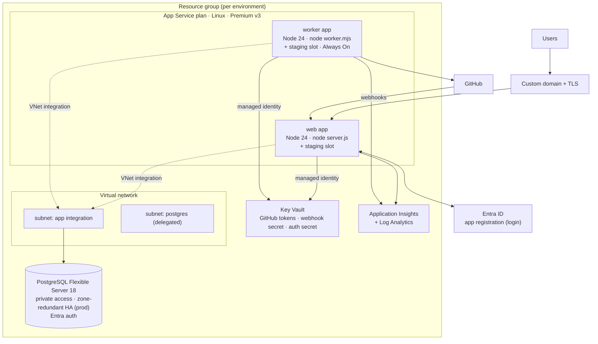
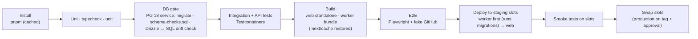

# 08 — Repository and Azure Deployment

One Next.js codebase (no monorepo tools, no `src/` folder) → two deployables built from the same commit → Azure App Service + Azure Database for PostgreSQL Flexible Server.

---

## 1. Repository

Folder layout and boundaries: `07-code-design.md` §1–2. Everything lives in **one package**: one `package.json`, one lockfile, one `tsconfig.json`, one ESLint config, one test setup.

### 1.1 Scripts (`package.json`)

| Script | Does |
|---|---|
| `dev` | Runs `dev:web` and `dev:worker` together (a small process runner such as `concurrently`) |
| `dev:web` | `next dev` |
| `dev:worker` | `tsx watch worker/main.ts` with `--conditions=react-server` |
| `build` | `build:web` then `build:worker` |
| `build:web` | `next build` (standalone output) |
| `build:worker` | `node scripts/build-worker.mjs` — esbuild bundles `worker/main.ts` → `dist/worker.mjs` |
| `typecheck` | `tsc --noEmit` (TypeScript 6; optional fast check with TS 7's native compiler in CI) |
| `lint` / `format` | ESLint (incl. import zones) / Prettier |
| `test` · `test:integration` · `test:e2e` | Vitest unit · Vitest + Testcontainers · Playwright |
| `db:generate` · `db:migrate` · `db:check` | drizzle-kit generate · apply migrations · run `drizzle/checks/schema-checks.sql` |
| `seed` | Dev data: admin, sample users, a sandbox workspace |

### 1.2 Dependency policy

- Exact versions in `package.json`; one lockfile; `engines.node` pinned to the App Service runtime (Node 24).
- Weekly grouped dependency-update PRs (Renovate or Dependabot); merge only when the full pipeline passes.
- Before adding a library: is it maintained, widely used, and does it remove real work? If not, write the 30 lines instead.

### 1.3 `next.config.ts` essentials

- `output: 'standalone'` (self-contained `server.js` for App Service).
- `typedRoutes` on; strict React mode.
- Security headers (CSP without inline scripts, HSTS, `X-Content-Type-Options`, `Referrer-Policy`).
- Compression left to the platform; the SSE route sets `Cache-Control: no-cache, no-transform` and is never compressed.

### 1.4 Build artifacts (from one CI build)

| Artifact | Contents | Deployed to |
|---|---|---|
| `web.zip` | `.next/standalone/` + `.next/static/` + `public/` | web app (`node server.js`) |
| `worker.zip` | `dist/worker.mjs` (+ source map) + `drizzle/` migrations | worker app (`node worker.mjs`) |

---

## 2. Azure architecture

### 2.1 App Service

| Setting | web | worker |
|---|---|---|
| Runtime | Node 24 LTS (Linux) | Node 24 LTS (Linux) |
| Startup | `node server.js` (standalone) | `node worker.mjs` |
| Instances | 2+ (autoscale on CPU / requests) | 1–2 (leases make extra instances safe) |
| Always On | on | **on** (required: no requests keep it awake) |
| Health check path | `/api/health` | `/health` on the worker's tiny HTTP server |
| HTTP/2 | on | — |
| ARR affinity | **off** (stateless; SSE resumes on any instance) | off |
| Identity | system-assigned managed identity | system-assigned managed identity |
| Secrets | App settings as **Key Vault references** | same |
| Deployment slot | `staging`, swap after smoke tests | `staging`, swap with web |

**SSE on App Service:** the platform ends requests that send nothing for about 230–240 s. The stream pings every 15 s, sends `Cache-Control: no-cache, no-transform`, and isn't compressed — validate in the first spike that events arrive unbuffered.

### 2.2 PostgreSQL Flexible Server

| Setting | Value |
|---|---|
| Version | 18 |
| Network | Private access (delegated subnet); no public endpoint |
| Auth | **Microsoft Entra** for apps: each app's managed identity is a database role mapped to `cp_web` / `cp_worker` (passwordless; tokens refreshed per connection). A break-glass admin in Key Vault |
| Pooling | App pools connect directly (5432) with modest pool sizes; built-in PgBouncer (6432) optional for web queries — **never** for the `LISTEN` connection |
| HA / backup | Zone-redundant HA in production; backup retention 35 days; maintenance window off-hours |
| Parameters | `idle_in_transaction_session_timeout = 30s`, `statement_timeout = 30s` (role-level), `pg_stat_statements` on |

### 2.3 Key Vault

- GitHub credentials: one secret each, named by the credential's `secret_ref`; admin UI writes through the web app's identity (`Key Vault Secrets Officer` on a dedicated vault), worker reads (`Secrets User`).
- Better Auth secret, GitHub webhook secret, Entra client secret (or federated credential).

### 2.4 Observability

Azure Monitor OpenTelemetry in both processes: request/queue/scheduler spans, dependency spans (Postgres, GitHub), logs with `requestId`, `runRequestId`, `workspaceId`. Alerts: worker unhealthy, oldest queue item > 2 min, no dispatch-capable credential for a workspace, credential expiring < 14 days, webhook failures, drift spike, DB CPU/connections.

---

## 3. CI/CD (GitHub Actions → Azure via OIDC, no stored Azure secrets)

Plain scripts, no task runner: the pipeline calls `pnpm lint`, `pnpm typecheck`, `pnpm test`, `pnpm db:check`, `pnpm build`, `pnpm test:e2e`. Caching: the pnpm store and `.next/cache` via the CI cache action.

**Migrations** run when the **worker** starts (staging slot first), under a Postgres advisory lock so only one instance applies them. The staging slot carries a **slot-sticky** setting `CP_WORKER_PROCESSING=off`, so the new worker only migrates and reports health until the swap; after the swap the production slot's setting (`on`) applies and it starts claiming work. Migrations are **expand-only** within a release (add now, remove in a later release), so the old web keeps working while the new schema is applied.

---

## 4. Local development

| Piece | How |
|---|---|
| Database | `docker compose up` → PostgreSQL 18; `pnpm db:migrate`; `pnpm seed` |
| App | `pnpm dev` → web on `localhost:3000` + worker in watch mode |
| Login | A development Entra app registration (localhost redirect) |
| GitHub | A dev PAT for a sandbox repo in `.env.local`; workspaces default to **polling mode** locally (no public webhook URL needed) |
| Offline | `CP_GITHUB_FAKE=1` uses the fake GitHub server from `e2e/` |

---

## 5. Environments

| Environment | Purpose | Data |
|---|---|---|
| local | Development | Docker Postgres, sandbox repo |
| staging | Pre-production; slot target | Own database and Key Vault; sandbox GitHub repos and tokens |
| production | Users | Own database (HA), own Key Vault, production tokens |

Infrastructure for staging and production comes from the same Bicep files (`infra/`) with different parameters.
