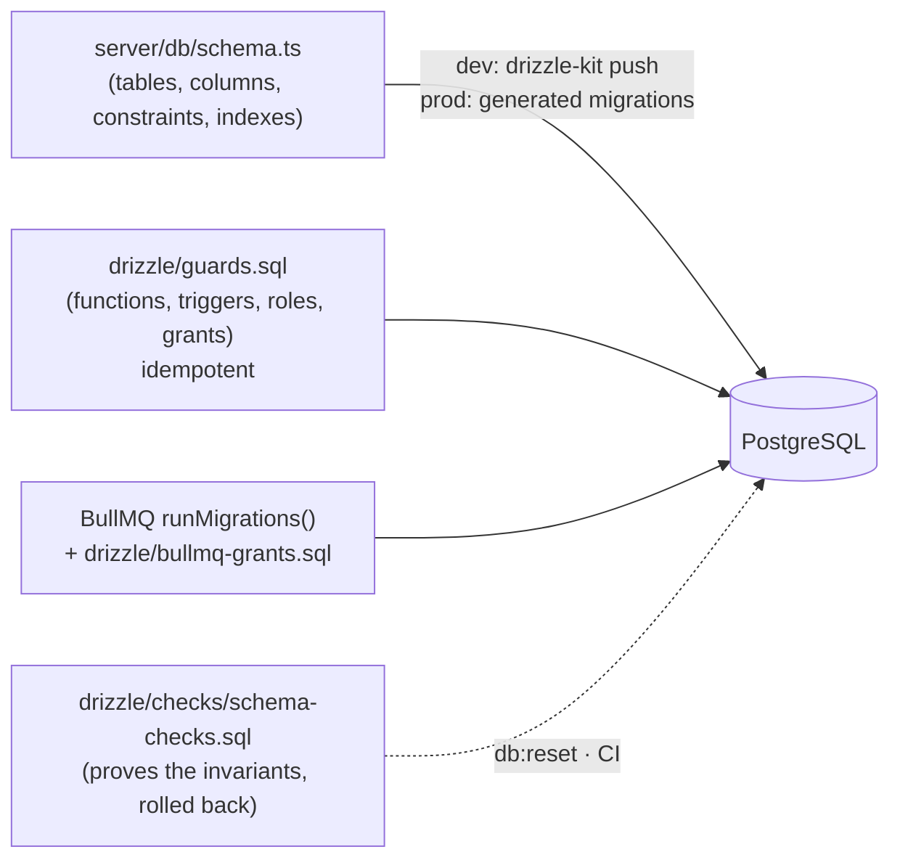

# 09 — Background Jobs (BullMQ on PostgreSQL) and the Database Lifecycle

Two decisions:

1. **No manual migrations.** Nobody writes migration SQL by hand, and nobody runs migrations by hand.
2. **BullMQ for all background work**, using BullMQ's official **PostgreSQL backend** — jobs live in the same database as everything else. No Redis.

---

## 1. BullMQ on PostgreSQL

BullMQ 6 (July 2026) ships an optional PostgreSQL backend that runs the same `Queue` / `Worker` / `QueueEvents` / `FlowProducer` API on PostgreSQL instead of Redis. Its objects live in their own schema (`bullmq` by default). Waiting workers block on `LISTEN/NOTIFY`, and state transitions are SQL functions in transactions. Retries with backoff, delays, priorities, deduplication, rate limiting and job schedulers all work as with Redis.

Trade-off (from BullMQ's own documentation): processing throughput is typically 1.5–2× lower than Redis, while single adds and bulk adds are close. This system processes a few jobs per second, so throughput is irrelevant; one database to operate and back up is worth far more.

### Queues

| Queue | Key | Work | Concurrency per worker |
|---|---|---|---|
| `dispatch` | run request id | Dispatch reconciler (send, verify, cancel) | 8 |
| `run-action` | run action id | Cancel / re-run on GitHub | 4 |
| `sync` | workspace id | Import / re-sync workflows and definitions | 2 |
| `check` | `runId:attempt` | Confirm an unfinished run with GitHub | 8 |
| `poll` | workspace id | List recent runs (polling-mode workspaces, safety net) | 4 |
| `webhook` | delivery GUID (also the job id) | Process a stored GitHub delivery | 8 |
| `maintenance` | — | Job schedulers: checker 15 s · approval expiry 1 min · credential health 10 min · housekeeping 6 h | 2 |

### How jobs are used (and why it stays correct)

- **Jobs carry only a key.** Handlers always re-read current state, so duplicates and late jobs are harmless (level-triggered design, `01` §2).
- **Enqueue happens after commit** (`enqueueAfterCommit` in the unit of work), so a job never points at uncommitted data. BullMQ's PostgreSQL backend uses its own connections, so a job can't join our transaction. If a process dies between the commit and the enqueue, the **sweepers** in the `checker` schedule find stuck requests and unprocessed deliveries and enqueue them.
- **"Look again later"** (a reconcile step returns `retryAfterSeconds`) becomes `followUp()`: a delayed job, deduplicated per key with a throttle window, so concurrent chains for one request collapse into one.
- **Failures** throw, and BullMQ retries them with exponential backoff (8 attempts). Exhausted jobs stay in the failed set for 7 days; the admin System page shows the counts.
- **Webhooks:** the endpoint stores the delivery (primary key = GitHub's delivery GUID, so duplicates are no-ops) and enqueues a job whose **job id is that GUID**, so BullMQ also refuses duplicates.
- **Schedulers:** `upsertJobScheduler` is idempotent and runs each tick once across all worker instances — this replaced the hand-built lease table.
- **Connections:** BullMQ gets its own `pg.Pool` (`QUEUE_POOL_MAX`) that sets `search_path` to `bullmq` and the least-privilege role on every connection. Each `Worker` also holds one dedicated `LISTEN` connection — size `max_connections` for it.

---

## 2. The database lifecycle — nothing manual

| Layer | Source of truth | Applied by | Why not drizzle-kit |
|---|---|---|---|
| Tables, columns, checks, FKs, indexes (incl. partial unique indexes), generated columns, identity | `server/db/schema.ts` | `drizzle-kit push` (dev) or drizzle's migrator with **generated** migrations (prod) | — |
| Guard functions, triggers, roles, grants, `read_events`, `pick_credential` | `drizzle/guards.sql` | `applyGuards()` — after **every** push/migrate | drizzle-kit doesn't manage functions, triggers or grants |
| BullMQ's schema | BullMQ | `runMigrations()` — idempotent, advisory-locked | Owned by BullMQ, versioned with BullMQ majors |
| Invariant proof | `drizzle/checks/schema-checks.sql` | `pnpm db:reset`, `pnpm db:check`, CI | It's a test, not a change |

`guards.sql` is **not a migration**: every statement is `CREATE OR REPLACE`, `IF NOT EXISTS` or a `GRANT`, so running it a hundred times leaves the same result. A unit test (`tests/state-machine-sync.test.ts`) fails if the state machine in `guards.sql` and `shared/phases.ts` ever differ.

### Commands

| Command | What it does | Where |
|---|---|---|
| `pnpm db:reset` | Drop `cp`, `auth`, `bullmq`, `drizzle` schemas → `drizzle-kit push --force` → guards → BullMQ migrations → **schema checks** | Local only (refuses non-local hosts and `NODE_ENV=production`) |
| `pnpm db:push` | `drizzle-kit push --force` → guards → BullMQ migrations | Local / dev databases |
| `pnpm db:check` | Run the invariant checks (needs an **empty** database; everything is rolled back) | Local, CI |
| `pnpm db:generate` | Generate migration files from `schema.ts` (drizzle-kit — never hand-edited) | Developer, before a release |
| `pnpm db:deploy` | Generated migrations → guards → BullMQ (same as the worker's start-up) | Ops / CI if needed |

### Development vs production

| | Development | Production |
|---|---|---|
| Schema changes | Edit `schema.ts` → `pnpm db:push` (or `db:reset`) | Edit `schema.ts` → `pnpm db:generate` → commit the generated files |
| Applied by | You, with one command | The worker on start (`DB_SETUP_ON_START=migrate`, default in production), under an advisory lock |
| Why different | Fast iteration, throwaway data | `push` decides changes at run time and with `--force` accepts data loss; generated migrations are reviewable in the pull request and replay identically in every environment |

Both paths are automatic; neither involves writing SQL by hand. CI should run `pnpm db:generate` and fail if it produces a diff — that catches a schema change without its generated migration.

### CI database gate

1. Start PostgreSQL 18.
2. `pnpm db:reset --force` → push + guards + BullMQ + checks (fails the build on any `FAIL:`).
3. `pnpm db:generate` → `git diff --exit-code drizzle/migrations`.
4. Unit tests (including the state-machine sync test).
